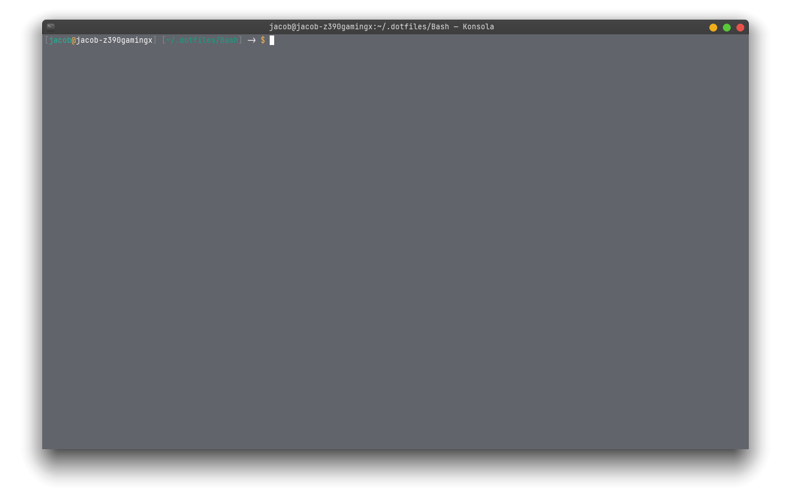

# .dotfiles
My dotfiles for essential programs on **GNU/Linux**.

## Installation
Just clone and move the repo to **/home/username/** and you should be good to go. 

## Software configs included in .dotfiles
- [Vim](https://github.com/vim/vim)
- [Visual Studio Code](https://code.visualstudio.com/)
- [Bash](https://www.gnu.org/software/bash/)
- [Git](https://git-scm.com/)

## Bash preview 

